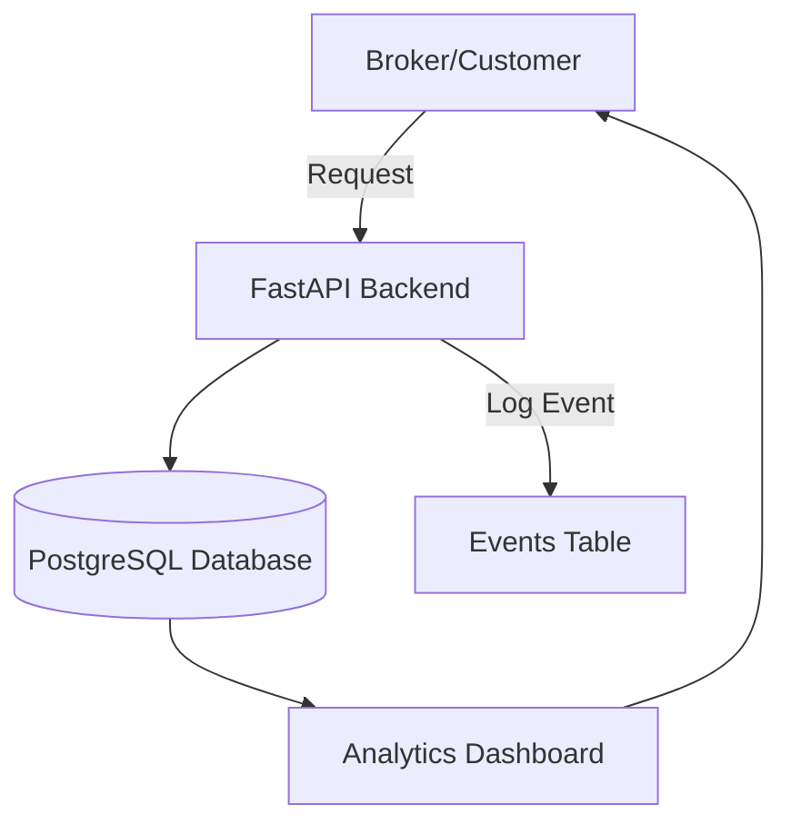

# Freight Broker Automation Platform  

This project is a full-stack implementation of a **freight brokerage automation workflow**. It combines:  

- **Load query and negotiation** via API/webhooks  
- **Event logging** for every broker request and system response  
- **Analytics dashboard** for visibility into broker activity and negotiation performance  
- **Deployment on Fly.io** for production-ready hosting  

Live deployment:  
- **App** → [freightbrokerhappyrobotai.fly.dev](https://freightbrokerhappyrobotai.fly.dev/)  
- **Dashboard** → [freightbrokerhappyrobotai.fly.dev/dashboard](https://freightbrokerhappyrobotai.fly.dev/dashboard)  
- **Video Demo** → [Loom Link](https://www.loom.com/share/983f0813eddf4f22ba3ba33756c81726?sid=bf0ac07f-fef1-46d2-8d14-547baf4a7658)  

---

## 📂 Project Structure  

```
.
├── db/
│   └── init/
│       ├── 001_schema.sql       # base schema
│       ├── 002_loads.sql        # sample loads seed
│       ├── 003_events.sql       # events schema
│       └── 004_seed_events.sql  # sample events seed
├── src/
│   ├── main.py                  # FastAPI app
│   ├── db_client.py             # DB connection logic
│   └── analytics.py             # log_event helper
├── Dockerfile
├── docker-compose.yml
├── requirements.txt
└── README.md
```

---

## 🚀 Features  

- **FastAPI Backend**: Routes for health checks, load queries, and negotiations  
- **PostgreSQL Database**: Stores loads, events, and analytics data  
- **Webhook Handling**: Supports structured JSON and free-text queries  
- **Analytics Dashboard**: HTML-based dashboard showing latest events  
- **Seed Data**: Pre-loaded loads and events for demo use  
- **Fly.io Deployment**: Dockerized for easy deployment and scaling  

---

## 🛠️ Local Setup  

### 1. Clone Repo  
```bash
git clone https://github.com/codesniper99/FreightBrokerAI
cd freight-broker-automation
```

### 2. Environment Variables  
Create a `.env` file:  
```ini
POSTGRES_DB=brokerdb
POSTGRES_USER=brokeruser
POSTGRES_PASSWORD=brokerpass
DATABASE_URL=postgresql://brokeruser:brokerpass@db:5432/brokerdb

WEBHOOK_URL=<connect to HappyRobotWorkflow>
API_KEY=<API Key for HappyRobotWorkflow>
FMCSA_API_KEY=<FMCSA Key>

NEGOTIATION_WEBHOOK_URL=<connect to negotiation HappyRobotWorkflow>
NEGOTIATION_API_KEY=<API Key for negotiation HappyRobotWorkflow>
# app will connect to the service name "db" on the default compose network
# DATABASE_URL=postgresql://broker:brokerpw@db:5432/brokerdb
DATABASE_URL=<Supabase URL for DB>
```

### 3. Start Services  
```bash
docker compose up --build
```

This will:  
- Launch **Postgres** with schema + seed data (`docker-entrypoint-initdb.d`)  
- Launch **FastAPI app** on port `8000`  
- Expose DB on `5432`  

---

## 🔍 Usage  

### Health Check  
```bash
curl http://localhost:8000/health
```

### Submit a Webhook Request  
Structured request:  
```bash
curl -X POST http://localhost:8000/webhook   -H "Content-Type: application/json"   -d '{"origin": "Chicago", "destination": "Dallas", "rate_min": 1200}'
```

### View Dashboard  
Navigate to:  
[http://localhost:8000/dashboard](http://localhost:8000/dashboard)  

---

## ☁️ Deployment on Fly.io  

### 1. Install Fly CLI  
```bash
curl -L https://fly.io/install.sh | sh
fly auth login
```

### 2. Create App  
```bash
fly launch
```

### 3. Set Secrets  
```bash
fly secrets set POSTGRES_DB=brokerdb POSTGRES_USER=brokeruser POSTGRES_PASSWORD=brokerpass
```

### 4. Deploy  
```bash
fly deploy
```

---

## 📊 Dashboard  

The dashboard provides real-time visibility into:  
- Incoming webhook/API requests  
- Event metadata (source, name, status, duration)  
- Payload data for debugging  
- Negotiation outcomes  

Access it live here:  
👉 [freightbrokerhappyrobotai.fly.dev/dashboard](https://freightbrokerhappyrobotai.fly.dev/dashboard)  

---

## 📈 Extending the System  

- **Broker Integrations**: Connect with TMS or load boards  
- **Dashboard Enhancements**: Add charts (negotiation success rate, average margin)  
- **User Management**: Secure dashboards per broker login  
- **Scaling**: Run multiple FastAPI workers behind Fly.io load balancer  

---

## 🔗 References  

- **Live Demo**: [freightbrokerhappyrobotai.fly.dev](https://freightbrokerhappyrobotai.fly.dev/)  
- **Dashboard**: [freightbrokerhappyrobotai.fly.dev/dashboard](https://freightbrokerhappyrobotai.fly.dev/dashboard)  
- **Outbound Campaign (HappyRobot)**: *(Insert your campaign link here)*  
- **Code Repo**: *(Insert GitHub link here)*  

---

## 🖼️ Architecture Overview  



## Other Considerations

Using HappyRobot.AI and AI agents deal with freight carrier loads

Do 
```bash
npm run build
```
 before doing flyctl deploy

and add new api paths to vite.config.ts for local testing